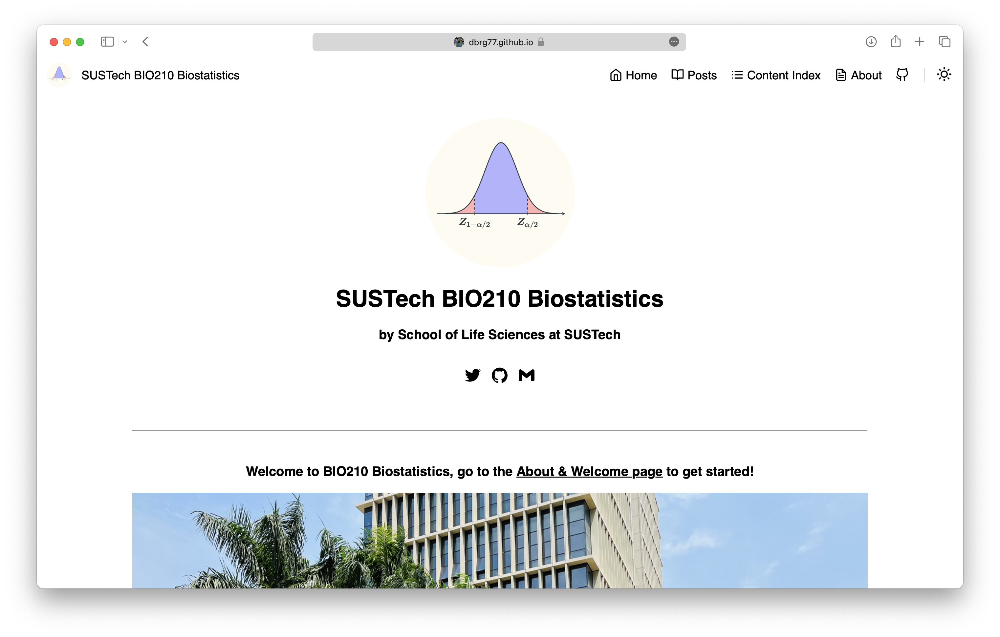

# Learning All Sorts
Never stop learning!

In one's life, lots of things are unknown but interesting, or to say, fascinating. I am kinda addicted to reading books and feels a strange kind of happiness while reading.

In this repository, I will gather all my notes on different subjects and books. I'm a pretty unorganized person, so they might be a bit messy.

## Learning Machine Learning
I am very interested in machine learning in my second year undergraduate studies. They seem to be so powerful in all the fields. So I found lots of books and videos to help me along the way of learning Machine Learning.

### Math for Deep Learning
[*Math for Deep Learning*](https://nostarch.com/math-deep-learning) is a book by Ronald T. Kneusel. It's also what brought me into the field of machine learning. The book covers all the basic math knowledge for learning machine learning, and is very easy to understand. The complexity, for a grade 2 student in university, is just in the right spot. Where I understand something but not everything. Very good book!

<figcaption align="center"><i>What a cute octopus</i></figcaption>

## Biostats
This is a repository by Lumi to store his Biostatistics cource notes, codes and most importantly, homeworks. Please read this README file carefully if you are thinking about using it to aid your study.

### About the Course BIO210

SUSTech BIO210 is a required course for both majors (Life science and Bioinformatics) of the SUSTech Biology department.

The course is taught by [Prof. Xi Chen](https://notarocketscientist.xyz), who is also my instrcutor and a very nice teacher. He made a [website](https://dbrg77.github.io/SUSTech-BIO210/) for this course so let's all go and star it. All course materials and reading materials can be found on the website so I'm not going to copy them over here.

I might consider putting all my Statistics and Probabilities notes from last year's Gab class here. It might happen, after I finished transferring them into $\LaTeX$.

### About the Codes
The language I learned to code in is Java, so my R is a bit poor. There might be a lot of un-elegant coding, so sorry about that. But the coding practices in the homework are really interesting, and I found them very fun.

### About the Homeworks
I gave up using paper to write my homework this year because I predicted there will be a lot of graph drawing and statistical analysis so I decided to write all my homework using R markdown. It is also a great practice for my R abilities. 

You are welcome to look at my homework and notes (if you are lucky and found this GitHub repo) to aid your study and enhance your understanding.
